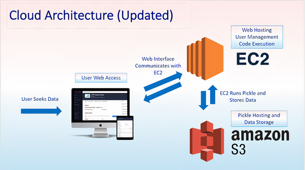

# Astro-Analytica
## Forecasting outcomes and election polls using twitter sentimental analysis

We have collected our data using twitter premium functionalities 

API calls are made using tweepy and the data which has been collected through this API is stored in an S3 bucket. 

We then use IAM roles for de-coupling the front end of the application(made using flask) from the back end(data being fetched from S3 bucket)

## Architecture

  

## Technologies Used
1)Flask for front end

2)Python for calling twitter API along with performing sentimental analysis   

3)AWS -Services Used 

  i)EC2 instance for hosting sites
  
  ii) s3 bucket-for storing twitter data 

## Fremium Services :
We will be offering our product to customers for a freemium service 
Freemium model in which some of the advanced services will be paid

1)No consultation necessary

2)Data will be refreshed weekly

3)Features Includes:

4)Analytics dashboard

5)Sentiment analysis by twitter handle 

6)Positive and negative word clouds

7)The ratio of positive to negative sentiments  
## Future Goals
After one month users will avail all services being provided with real-time data and analytics being tailor-made for this purpose   
Consultation is required  for 
1)Real-time dashboards

2)Services include:

3)Customized interface 

4)API available for data integration​

5)Access to historical data

6)SSO integration
